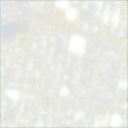
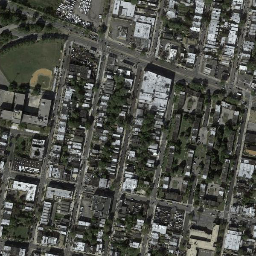
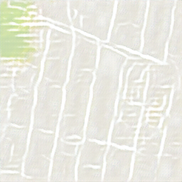
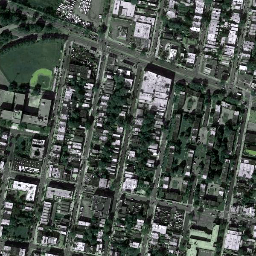
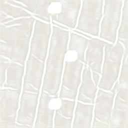
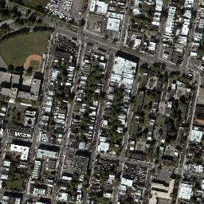
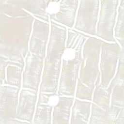

# Pix2Pix Image-to-Image cGAN

This project uses the **Pix2Pix** model, a type of **Conditional Generative Adversarial Network (cGAN)**, to perform **image-to-image translation**. The model is trained to learn the relationship between paired images (input-output pairs) and generate a transformed version of the input image. 
Implemented with **PyTorch**, inspired by the original paper _"Image-to-Image Translation with Conditional Adversarial Networks"_ by Isola et al. The model learns to map input images to output images (like sketches to real photos or maps to aerial views).

The Pix2Pix model can be used to convert one type of image to another. This project explores using **Pix2Pix** for creative and practical applications, such as converting sketches to realistic images, transforming day to night scenes, and much more.


This repository was heavily inspired by and adapted from:
- 📚 [Aladdin Persson's GitHub Repo](https://github.com/aladdinpersson/Machine-Learning-Collection/tree/master/ML/Pytorch/GANs/Pix2Pix)
- 🎥 [Aladdin Persson's YouTube Tutorial](https://www.youtube.com/watch?v=SuddDSqGRzg&list=PLhhyoLH6IjfxeoooqP9rhU3HJIAVAJ3Vz&index=38&ab_channel=AladdinPersson)

---
### Key Features:
- **Generative Adversarial Networks (GANs)**: The model consists of a **Generator** and a **Discriminator**. The Generator tries to create realistic images, while the Discriminator attempts to distinguish between real and generated images. This adversarial process helps improve both the Generator and the Discriminator.
- **U-Net Architecture**: The Generator uses a U-Net architecture with **skip connections** to retain detailed information.
- **PatchGAN**: The Discriminator uses a PatchGAN architecture that classifies patches of the image as real or fake.

---

## 🧠 What is Pix2Pix?

Pix2Pix is a type of **conditional GAN (cGAN)** that learns to translate images from one domain to another. Instead of generating images from random noise, the generator receives an input image and tries to convert it into a corresponding target image. The **generator** tries to fool the **discriminator**, which tries to distinguish between real (ground truth) and fake (generated) images.

The two networks are in a "game":  
🎨 The **Generator** says: “Here’s a real-looking image!”  
🕵️‍♂️ The **Discriminator** replies: “Hmm… is this fake or real?”  
Over time, the Generator gets better at faking it, and the Discriminator gets better at catching fakes—until the generated images are nearly indistinguishable from the real ones.

Pix2Pix uses an **L1 loss** in addition to the GAN loss to ensure the output is not only realistic but also close to the ground truth in pixel values.

---

## 🏗️ Architecture: U-Net Generator + PatchGAN Discriminator

- The **Generator** uses a **U-Net** architecture:
  - An **encoder** compresses the input image (downsampling).
  - A **bottleneck** represents the compressed latent state.
  - A **decoder** reconstructs the image (upsampling).
  - **Skip connections** between corresponding encoder and decoder layers help retain fine details (great for preserving structure and edges).

- The **Discriminator** uses a **PatchGAN**:
  - Rather than classifying the whole image as real or fake, it evaluates local patches (like 70x70) and determines if each patch is real. This focuses the discriminator on high-frequency, texture-like details.

---

## 📁 Project Structure and File Descriptions

- `dataset.py`: Handles loading paired datasets (e.g., image and its target). Transforms images, splits into training/test sets, and ensures inputs/outputs are aligned. In this case the dataset is [Kaggle Pix2Pix Dataset (Maps)](https://www.kaggle.com/datasets/vikramtiwari/pix2pix-dataset?resource=download)

- `generator.py`: Defines the **U-Net** generator architecture. Includes the encoder, bottleneck, and decoder with skip connections.

- `discriminator.py`: Defines the **PatchGAN** discriminator. Evaluates real vs. fake patches in an input-output image pair.

- `train.py`: Training loop where the Generator and Discriminator are updated adversarially. Also handles saving checkpoints and printing loss stats.

- `utils.py`: Utility functions like saving generated image outputs, showing progress, and calculating loss.

- `config.py`: Contains hyperparameters such as learning rate, batch size, and file paths. 

---

## 📦 Dataset

The project uses a Pix2Pix-ready dataset from Kaggle:  
[🗺 Pix2Pix Dataset (Maps)](https://www.kaggle.com/datasets/vikramtiwari/pix2pix-dataset?resource=download)  
It contains paired images where the left half is a satellite map and the right half is a street map. The goal is to train the model to convert one into the other.

You can replace this with your own dataset of **paired images** — just follow the same image layout.

---

## 🚀 Training
To train the model, follow these steps:

1. Install dependencies:
```bash
pip install -r requirements.txt 
```
2. Modify `config.py` to change parameters and data folder dor train and validation

3. Run training file:
```
python train.py
```

## Installation

### Requirements:
- Python 3.x
- PyTorch
- torchvision
- albumentations
- tqdm
---
### Setup:
1. Clone the repository:
   ```bash
   git clone https://github.com/alexcega/pix2pix.git
   cd pix2pix

---
## 📈 Results over Training (Epoch Progress)

Here is a comparison of input/output pairs generated by the Pix2Pix model at different training stages. Each image shows the input on the **left** and the generated output on the **right**.

| **Epoch 1**                  | **Epoch 150**                |
|-----------------------------|------------------------------|
|    |    |


| **Epoch 300**                | **Epoch 500**                |
|-----------------------------|------------------------------|
|    |     |

## 📄 Reference Links
- 🧠 Pix2Pix Paper (Isola et al., 2017): [arXiv](https://arxiv.org/abs/1611.07004v3)
- 🔍 Paper explanation: [Papers with Code](https://paperswithcode.com/method/pix2pix)
- 💾 Original implementation by authors (CycleGAN + Pix2Pix): [GitHub](https://github.com/junyanz/pytorch-CycleGAN-and-pix2pix/blob/9e6fff7b7d5215a38be3cac074ca7087041bea0d/models/pix2pix_model.py#L6)
- 🗺 Dataset used: [Kaggle Pix2Pix Dataset (Maps)](https://www.kaggle.com/datasets/vikramtiwari/pix2pix-dataset?resource=download)
